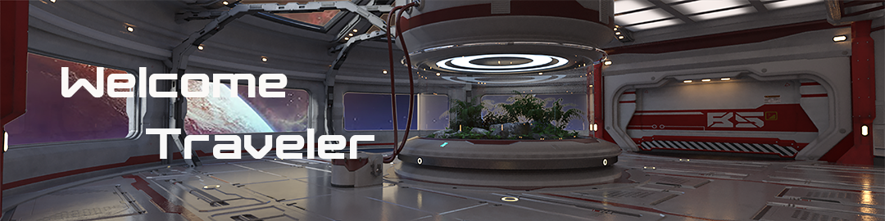
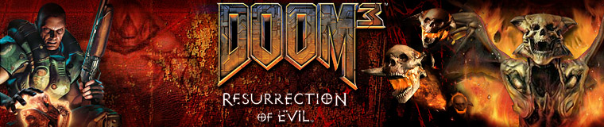
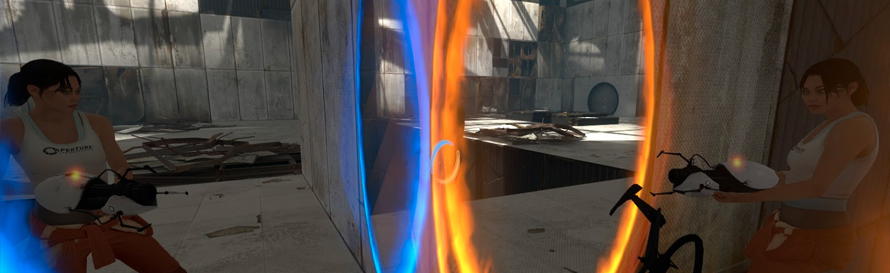
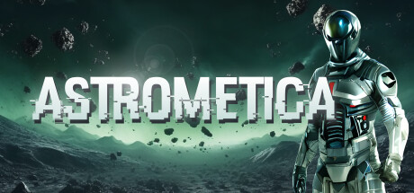

  

Thanks for stopping by!

### About Me

I consider myself a life-long learner with a heavy bent toward technology and solutions.  I'm a Java/J2EE Developer/Architect by trade, and have been active in the professional development community since 1983.  If you'd like to review my career you can check out my resume at my personal website (currently under construction):

    https://danielcarda.net/resume/
    
I started programming in 1979 while still in High School.  The school had purchased a TRS-80 Model I.  This machine didn't even have disk drives and used an external tape drive as storage.  I self taught myself TRS Basic and programed a version of Star Trek and was hooked from that point on.

During college I graduated to a Honeywell 6000 w/EIS mainframe.  I found it to be a fertile ground for hacking!  😄

I started my professional career at the same time the Micro Computer Revolution started.  (I even worked on the original IBM PC (single 360k floppy drive).  I've seen a lot of change over these decades.  Some good, some not so good.

----

### Education

| Institution          | Degree               | Field of Study                    |
|:--------------------:|:--------------------:|:---------------------------------:|
| University of Alaska | Assocates of Arts    | Computer Information Systems      | 
| Tusculum University  | Bachelors of Science | Applied Organizational Management |

### Technical Skills

|              |            |                                |               |            |
|:------------:|:----------:|:------------------------------:|:-------------:|:----------:|
| Ada          | Bit Bucket | Groovy/Grails | JDBC           | MongoDB       | Spring MVC |
| Agile        | C/C++      | HTML          | Jenkins        | Multithreaded | SCRUM      |
| AJAX         | CI/CD      | Intellij      | JMS            | Oracle        | SQL        |
| Apache Ant   | DB/2       | J2EE          | JSF            | QPID ESB      | WebLogic   |
| Apache CXF   | Docker     | Java          | JSON           | REST          | WebSphere  |
| Apache Maven | Eclipse    | Java Swing    | JSP            | SOAP          | Wildfly    |
| AWS          | EJB        | JavaScript    | JUnit          | Spring        | XML        |
| Bash         | Git        | JBoss         | Micro Services | Spring Boot   |            |

### Hobbies / Interests

I do have a wide varity of interestes.  Almost to many to list here.  

One of the things I like to do is create digital pictures.  You can see a few of them at the home page of my personal website  (under construction)

    https://daniel.carda.net

I also enjoy photography.  You can see my photo album here (under construction):

    https://daniel.carda.net/album

I'm also an avid gamer.  Here's a few of the games I'm interested in.

Subnautica
Love building games!
  

Doom 3
It was just <b>so</b> well done!

  

Portal (Both releases!)
Why can't they make more???  [BTW, the cake is real!]
  

Currently playing
No mans sky
  

Looking foward to 
  

<!--
**dcarda/dcarda** is a ✨ _special_ ✨ repository because its `README.md` (this file) appears on your GitHub profile.

Here are some ideas to get you started:

- 🔭 I’m currently working on ...
- 🌱 I’m currently learning ...
- 👯 I’m looking to collaborate on ...
- 🤔 I’m looking for help with ...
- 💬 Ask me about ...
- 📫 How to reach me: ...
- 😄 Pronouns: ...
- ⚡ Fun fact: ...
-->
